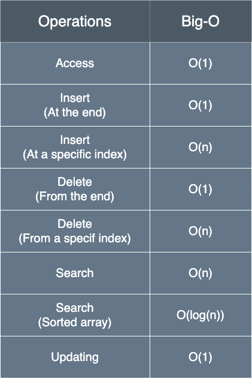

## 🧠 Core Array Fundamentals

### 1. Key Characteristics
* **Same Data Type**: All elements must belong to a single type (e.g., all `int`, `float`, or `String`).
* **Index-Based Access**: Elements are accessed via a zero-based index system (starting at `0`).
* **Contiguous Memory**: Elements sit in consecutive memory locations, allowing fast, direct address calculations.

---

### 2. Static vs. Dynamic Arrays


| Feature | Static Arrays | Dynamic Arrays |
| :--- | :--- | :--- |
| **Size** | Fixed at creation time | Can grow or shrink during runtime |
| **Memory Allocation** | Stack (or fixed heap block) | Heap (allocated and resized dynamically) |
| **Resizing** | Not possible without manual recreation | Handled automatically (requires internal copying) |
| **Performance** | Fast access, zero overhead for size changes | Flexible, but resizing actions carry an $\mathcal{O}(N)$ cost |
| **Ease of Use** | Simple and memory-efficient | Highly flexible, abstracts resizing logic away |
| **Use Case** | Best when data size is known and constant | Best when dataset size is unknown or highly variable |

---

### 3. Quick Decision Guide
* **Use Static Arrays** when the total number of elements is fixed and predictable.
* **Use Dynamic Arrays** when elements need to be added or removed constantly during runtime.

```java
// Static Array: Fixed allocation of 5 primitive slots
int[] staticArray = new int[5]; 
staticArray[0] = 1; 

// Dynamic Array: Resizable object wrapper container
ArrayList<Integer> dynamicArray = new ArrayList<>(); 
dynamicArray.add(1); 
```




## 🎯 Key Considerations for Arrays in Coding Interviews

### 1. Validate Assumptions
* **Duplicates**: Ask the interviewer if duplicate values are allowed in the dataset.
* **Sorted vs. Unsorted**: Clarify the order. Sorted arrays unlock faster algorithms like Binary Search.

### 2. Handle Boundaries
* **Index Out of Bounds**: Always ensure indices stay within `0` and `length - 1`.
* **Negative Indices**: Remember that Java does not support negative indexing natively like Python does.

### 3. Efficiency Considerations
* **Slicing & Concatenation**: These take $\mathcal{O}(N)$ time. Avoid doing them inside heavy loops.
* **In-Place vs. Extra Space**: Prioritize modifying the input array directly to achieve $\mathcal{O}(1)$ auxiliary space.

### 4. Loops & Naming
* **Descriptive Variable Names**: Use pointers like `left`, `right`, or `slow`, `fast` to improve clarity.
* **Watch Loop Indices**: Triple-check your loop termination conditions to eliminate off-by-one errors.

### 5. Algorithm Choice
* **Complexity Analysis**: Be ready to explain and justify both your Time and Space complexities.
* **Nested Loops**: Avoid them whenever possible to prevent your time complexity from spiraling to $\mathcal{O}(N^2)$.

### 6. Testing & Edge Cases
* **Boundary Sizes**: Test your code against empty arrays (`[]`) and single-element arrays (`[X]`).
* **Scale Testing**: Walk through how your solution scales up when given massive datasets.

### 7. Handling Special Values
* **Zero & Negatives**: Pay special attention to signs when solving sum, product, or sub-array problems.

### 8. Modifying While Iterating
* **Concurrent Modification**: Avoid removing or adding items to a collection while looping through it.
* **Safe Traversal**: Iterate backward or use an explicit `Iterator` object to modify safely.

---

## ⚡ Java Arrays & ArrayLists Cheat Sheet

### 1. Fixed-Size Arrays (`int[]`, `String[]`)
Standard arrays have a fixed memory footprint. Custom manipulations require static utility methods from `java.util.Arrays`.


| Operation / Method | Time Complexity | Space Complexity | Interview Context / Notes |
| :--- | :--- | :--- | :--- |
| **Access / Modify** (`arr[i] = val`) | $\mathcal{O}(1)$ | $\mathcal{O}(1)$ | Immediate memory offset lookup. |
| **Length** (`arr.length`) | $\mathcal{O}(1)$ | $\mathcal{O}(1)$ | Reads an internal metadata field. |
| **Linear Search** (Manual Loop) | $\mathcal{O}(N)$ | $\mathcal{O}(1)$ | Worst-case requires scanning every element. |
| **Sort** (`Arrays.sort(arr)`) | $\mathcal{O}(N \log N)$ | $\mathcal{O}(N)$ or $\mathcal{O}(1)$ | Primitives: Dual-Pivot Quicksort ($\mathcal{O}(1)$ space). Objects: Timsort ($\mathcal{O}(N)$ space). |
| **Binary Search** (`Arrays.binarySearch(arr, tgt)`) | $\mathcal{O}(\log N)$ | $\mathcal{O}(1)$ | **Requires sorted array**. Returns negative index if missing. |
| **Copy / Resize** (`Arrays.copyOf(arr, newLen)`) | $\mathcal{O}(N)$ | $\mathcal{O}(N)$ | Allocates a brand new block of memory and duplicates data. |

---

### 2. Dynamic Arrays (`ArrayList<T>`)
An `ArrayList` manages a resizable backing array under the hood. Resizing defaults to scaling by 1.5x.


| Operation / Method | Time Complexity | Space Complexity | Interview Context / Notes |
| :--- | :--- | :--- | :--- |
| **Get / Set** (`list.get(i)` / `list.set(i, val)`) | $\mathcal{O}(1)$ | $\mathcal{O}(1)$ | Direct indexing into the underlying array. |
| **Append** (`list.add(val)`) | $\mathcal{O}(1)$ *Amortized* | $\mathcal{O}(1)$ | Takes $\mathcal{O}(N)$ only when capacity fills up and forces a resize. |
| **Insert** (`list.add(idx, val)`) | $\mathcal{O}(N)$ | $\mathcal{O}(1)$ | Shifts all elements to the right. Inserting at index `0` is $\mathcal{O}(N)$. |
| **Remove** (`list.remove(idx)`) | $\mathcal{O}(N)$ | $\mathcal{O}(1)$ | Shifts all elements to the left. Removing from index `0` is $\mathcal{O}(N)$. |
| **Lookup** (`list.contains(val)`) | $\mathcal{O}(N)$ | $\mathcal{O}(1)$ | Scans sequentially. Convert to `HashSet` if $\mathcal{O}(1)$ lookups are vital. |
| **Size** (`list.size()`) | $\mathcal{O}(1)$ | $\mathcal{O}(1)$ | Returns a simple counter tracker. |

---

### 🚨 Critical Interview Traps
* **The $\mathcal{O}(N^2)$ Trap**: Never use `list.remove(0)` or `list.add(0, val)` inside a loop. It forces an element shift every iteration. Use a **deque** (`ArrayDeque`) or **two-pointer technique** instead.
* **Pre-allocate Capacity**: If the problem dictates the maximum size (e.g., matching input array length `N`), instantiate it using `new ArrayList<>(N)` to completely eliminate execution overhead from lazy dynamic resizing.
